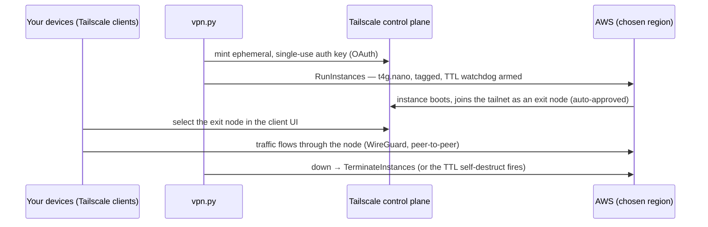

# vpn-aws

**Ephemeral, pay-per-use personal VPN exit nodes on AWS, powered by
[Tailscale](https://tailscale.com/).**

One command creates a tiny EC2 instance in the AWS region of your choice;
it joins your tailnet as an exit node and your devices route their internet
traffic through it. One command (or an automatic self-destruct timer) tears
it down. While you're not using it, **nothing runs and nothing costs
anything**.

```sh
./vpn.py up eu-central-1     # ~90s later: pick the exit node in your Tailscale client
./vpn.py down                # back to zero — no instances, no residue
```

## How it works



Design properties:

- **Zero-residue by construction** — the only resource ever created is one
  tagged EC2 instance: default VPC, default security group (no inbound rules
  needed — the node only makes outbound connections), no key pair, no
  Elastic IP, root volume destroyed on termination. Teardown = terminate;
  there is nothing that *can* be orphaned.
- **Self-destruct watchdog** — every instance terminates itself at a TTL
  (default 4h) even if you forget it or your laptop dies. A forgotten
  session costs cents, not a month.
- **No state files** — sessions are discovered by AWS tags; `status` and
  `down` work from any machine with the credentials, even after a crash.
- **Great clients for free** — exit node selection is native Tailscale UX on
  Windows, macOS, Linux, iOS and Android; any number of your devices can use
  the node simultaneously.

The full decision process — alternatives considered (Algo, Outline, AWS
Client VPN, plain WireGuard, commercial VPNs) and why this design won — is
in [docs/DECISIONS.md](docs/DECISIONS.md).

## What this is not

- **Not an anonymity tool** — traffic egresses from an IP tied to your own
  AWS account. It shifts trust from your local network/ISP to AWS.
- **Not for unblocking streaming** — streaming services commonly block
  datacenter IPs. Geolocation itself works fine (your traffic exits in the
  region you chose).

## Getting started

One-time setup (~40 minutes total), each step is a runbook:

| # | Runbook | What you set up |
|---|---------|-----------------|
| 1 | [Tailscale setup](docs/runbooks/01-tailscale-setup.md) | tailnet, clients, tag + auto-approval policy, OAuth client |
| 2 | [AWS setup](docs/runbooks/02-aws-setup.md) | minimal IAM policy/user, local credentials, billing guard |
| 3 | [Install & configure](docs/runbooks/03-install-and-configure.md) | uv, the repo, `~/.config/vpn-aws/config.toml` |

Then, per session:

| Runbook | |
|---------|---|
| [Start a session](docs/runbooks/04-start-session.md) | `up <region>`, pick the exit node, verify |
| [End a session](docs/runbooks/05-end-session.md) | deselect, `down`, verify zero |
| [Troubleshooting & audit](docs/runbooks/06-troubleshooting.md) | when something misbehaves; leftover/cost audit |

## Commands

| Command | Effect |
|---------|--------|
| `./vpn.py up <region> [--ttl 2h]` | create an ephemeral exit node in `<region>` (TTL: self-destruct timeout, default 4h) |
| `./vpn.py down [region]` | terminate exit nodes — one region, or all of them |
| `./vpn.py status` | tagged instances across all regions + tailnet exit node state |
| `./vpn.py regions` | list the AWS regions enabled on your account |

Requirements: [uv](https://docs.astral.sh/uv/) (provides Python and
dependencies automatically), AWS credentials, a free Tailscale account.

## Cost

Assuming ~10 hours/month of use on the default `t4g.nano`:

| Item | Rate | Per 2h session | Per month |
|------|------|----------------|-----------|
| EC2 instance | ~$0.0042/h | ~$0.01 | ~$0.04 |
| Public IPv4 | $0.005/h | ~$0.01 | ~$0.05 |
| Egress traffic | ~$0.09/GB | $0.10–0.30 | $0.90–2.70 |
| Tailscale (Personal plan) | free | — | — |
| **Total** | | **~$0.15–0.30** | **~$1–3** |

Idle cost: **$0**.

## Security notes

- The Tailscale OAuth secret lives only in `~/.config/vpn-aws/config.toml`
  (chmod 600). Per-session auth keys are single-use, tag-locked,
  pre-authorized and expire after 15 minutes.
- Instances require IMDSv2, expose no inbound ports, have no SSH key pair;
  optional emergency access is via Tailscale SSH only.
- The IAM policy ([docs/iam-policy.json](docs/iam-policy.json)) can only
  launch instances that are tagged `Project=vpn-aws` at creation and only
  terminate instances carrying that tag.

## Project documentation

- [docs/DECISIONS.md](docs/DECISIONS.md) — the full design decision record.
- [docs/runbooks/](docs/runbooks/) — step-by-step runbooks for every
  activity, one-time and recurring.
